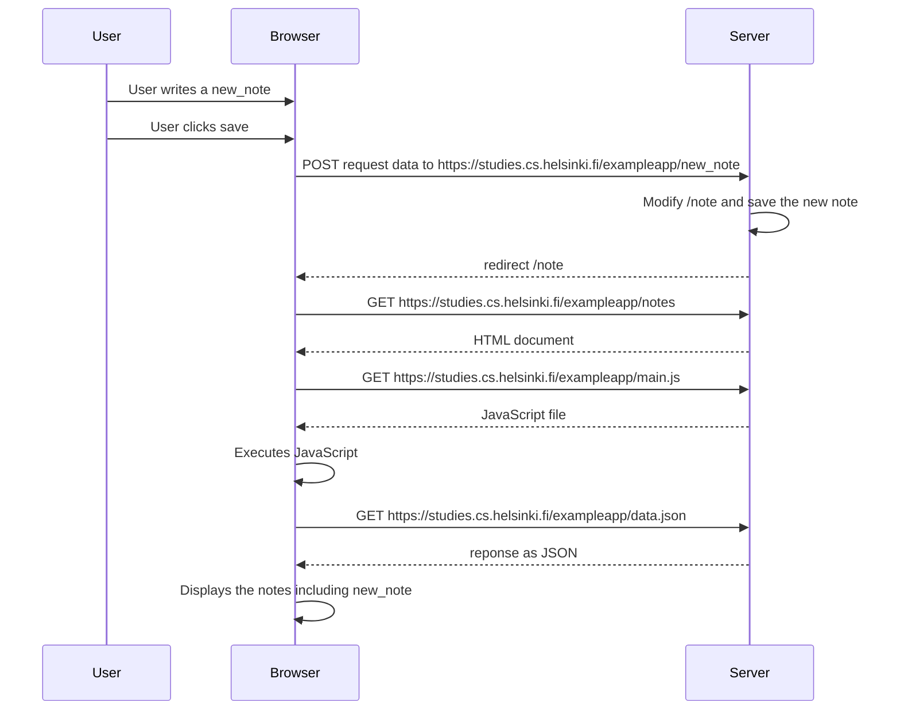

```mermaid
sequenceDiagram
    participant User
    participant Browser
    participant Server

    User->>Browser: User writes a new_note
    User->>Browser: User clicks save

    Browser->>Server: POST request data to https://studies.cs.helsinki.fi/exampleapp/new_note
    Server->>Server: Modify /note and save the new note

    Server-->>Browser: redirect /note

    Browser->>Server: GET https://studies.cs.helsinki.fi/exampleapp/notes
    Server-->>Browser: HTML document

    Browser->>Server: GET https://studies.cs.helsinki.fi/exampleapp/main.js
    Server-->>Browser: JavaScript file

    Browser->>Browser: Executes JavaScript

    Browser->>Server: GET https://studies.cs.helsinki.fi/exampleapp/data.json
    Server-->>Browser: reponse as JSON

    Browser->>Browser: Displays the notes including new_note
```