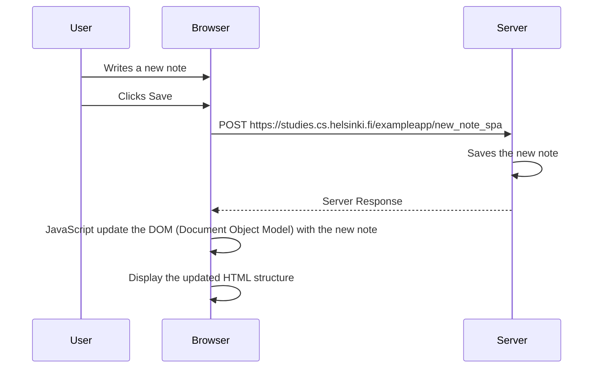

```mermaid
sequenceDiagram
    participant User
    participant Browser
    participant Server

    User->>Browser: Writes a new note
    User->>Browser: Clicks Save

    Browser->>Server: POST https://studies.cs.helsinki.fi/exampleapp/new_note_spa
    Server->>Server: Saves the new note
    Server-->>Browser: Server Response

    Browser->>Browser: JavaScript update the DOM (Document Object Model) with the new  note
    Browser->>Browser: Display the updated HTML structure
```