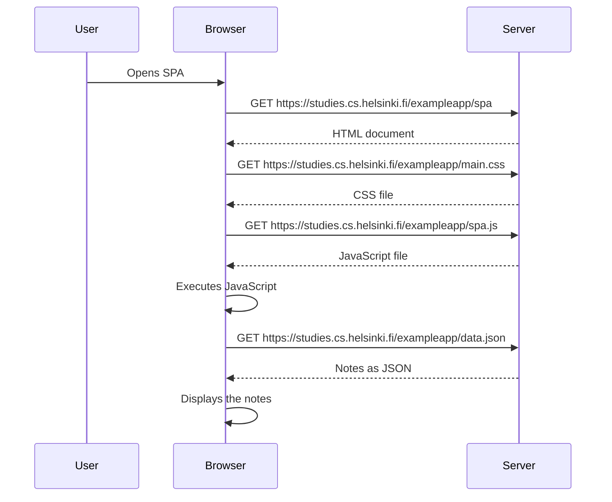

```mermaid
sequenceDiagram
    participant User
    participant Browser
    participant Server

    User->>Browser: Opens SPA

    Browser->>Server: GET https://studies.cs.helsinki.fi/exampleapp/spa
    Server-->>Browser: HTML document

    Browser->>Server: GET https://studies.cs.helsinki.fi/exampleapp/main.css
    Server-->>Browser: CSS file

    Browser->>Server: GET https://studies.cs.helsinki.fi/exampleapp/spa.js
    Server-->>Browser: JavaScript file

    Browser->>Browser: Executes JavaScript

    Browser->>Server: GET https://studies.cs.helsinki.fi/exampleapp/data.json
    Server-->>Browser: Notes as JSON

    Browser->>Browser: Displays the notes
```